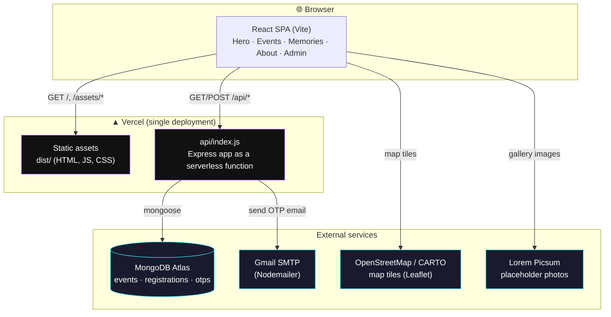
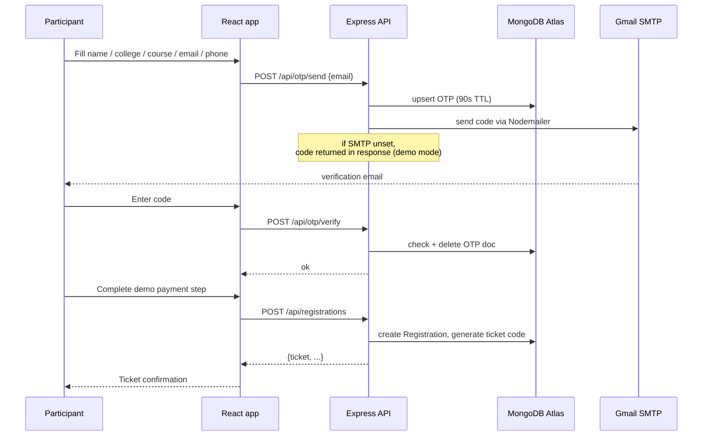

# Gateways — College Fest Site

A Minecraft-biome-themed college fest site: a 3D hero portal, 12 events across
biomes, email-OTP-verified registration with a demo payment step, a memories
wall, and an admin dashboard — built with React + Three.js + GSAP on the
front end and Express + MongoDB on the back end, deployed as a single app on
Vercel.

**Live:** https://gateways-fest.vercel.app
**Admin:** https://gateways-fest.vercel.app/admin *(credentials in `server/.env` — see [Access](#access) below)*

---

## Architecture

Frontend and backend ship as **one Vercel deployment**: the React app is
built as static assets, and the Express API runs as a single Vercel
serverless function. Both talk to a MongoDB Atlas cluster.



### Request routing (`vercel.json`)

| Path | Destination |
|---|---|
| `/api/*` | `api/index.js` (Express serverless function) |
| everything else (e.g. `/admin`, `/#events`) | `index.html` (client-side routing / SPA fallback) |
| `/assets/*`, `/favicon.svg` | served directly from `dist/` |

### Registration flow



---

## Features

- **Hero** — Three.js floating-island scene, particle/pressure title text, aurora background, scroll parallax
- **Events** — 12 events across 7 biomes, each with its own procedurally-built 3D voxel diorama
- **Registration** — real email OTP verification (Nodemailer/Gmail), demo payment step, unique ticket code per registration
- **Memories** — a 3D "drift wall" gallery of past-season photos with a lightbox
- **About** — animated stat counters, event timeline, embedded venue map (Leaflet/OSM), FAQ accordion
- **Admin dashboard** (`/admin`) — username/password login, lists all registrations from MongoDB
- Smooth inertia scrolling (Lenis) synced with GSAP ScrollTrigger throughout

## Tech stack

| Layer | Tech |
|---|---|
| Frontend | React 19, Vite, Tailwind CSS, GSAP, Three.js, Lenis, Leaflet |
| Backend | Express, Mongoose |
| Database | MongoDB Atlas |
| Email | Nodemailer (Gmail SMTP) |
| Hosting | Vercel (static + serverless function) |

## Project structure

```
├── api/
│   └── index.js          # Vercel serverless entry — wraps the Express app
├── server/
│   └── src/
│       ├── app.js        # Express app (routes + middleware)
│       ├── config/db.js  # Mongoose connection
│       ├── models/       # Event, Registration, Otp
│       ├── routes/       # events, otp, registrations, admin
│       └── lib/mailer.js # Nodemailer wrapper
├── src/
│   ├── components/       # React components (Hero, EventsGrid, AboutSection, ...)
│   │   └── reactbits/    # Counter, TrueFocus, TextPressure, ParticleText, DriftWall
│   ├── three/            # Three.js scene builders (voxel biomes, hero scene)
│   ├── hooks/            # useEvents, useSmoothScroll, useLiveWeather
│   └── lib/               # api.js (fetch client), otp.js
└── vercel.json            # routing: /api/* → function, everything else → SPA fallback
```

## Local development

Requires Node 18+ and a MongoDB connection (local `mongod` or an Atlas cluster).

```bash
# install
npm install

# copy env templates and fill in real values
cp .env.example .env.development.local
cp server/.env.example server/.env

# seed the database with the 12 events
cd server && npm run seed && cd ..

# run backend (localhost:4000) and frontend (localhost:5173) in two terminals
cd server && npm run dev
npm run dev
```

### Environment variables

**Root `.env.development.local`** (dev only — production build uses a relative `/api` path automatically):

| Variable | Purpose |
|---|---|
| `VITE_API_URL` | Backend URL for local dev, e.g. `http://localhost:4000/api` |

**`server/.env`**:

| Variable | Purpose |
|---|---|
| `MONGODB_URI` | MongoDB connection string (local or Atlas) |
| `PORT` | Local Express port (dev only) |
| `CLIENT_ORIGIN` | Allowed CORS origin (dev only) |
| `ADMIN_KEY` | Internal key `/api/registrations` requires (issued after admin login) |
| `ADMIN_USER` / `ADMIN_PASS` | Login credentials for `/admin` |
| `SMTP_HOST` / `SMTP_PORT` / `SMTP_USER` / `SMTP_PASS` / `SMTP_FROM` | Gmail SMTP for real OTP email delivery. Leave unset to fall back to demo mode (code shown in the UI instead of emailed). |

Same variables are set in the Vercel project (Production environment) for the live deployment — see `vercel env ls`.

## Deployment

Deployed via the Vercel CLI (`vercel deploy --prod`), linked to the
`gateways-fest` project. The frontend builds via `vite build`; the backend
runs as `api/index.js`, a single serverless function wrapping the Express
app with a cached Mongoose connection (reused across warm invocations
instead of reconnecting per request).

To redeploy after changes:

```bash
vercel deploy --prod
```

## Access

| What | Where |
|---|---|
| Live site | https://gateways-fest.vercel.app |
| Admin dashboard | https://gateways-fest.vercel.app/admin — sign in with `ADMIN_USER` / `ADMIN_PASS` (see `server/.env`, not committed) |
| MongoDB Atlas | Cluster `GatewaysFSD8` — connection string in `server/.env` as `MONGODB_URI` |
| Email sender | Gmail account in `SMTP_USER`, authenticated via an app password in `SMTP_PASS` |

Credentials are intentionally **not** included in this file since it's
version-controlled — they live only in the gitignored `.env` files locally
and as encrypted environment variables in the Vercel project.
