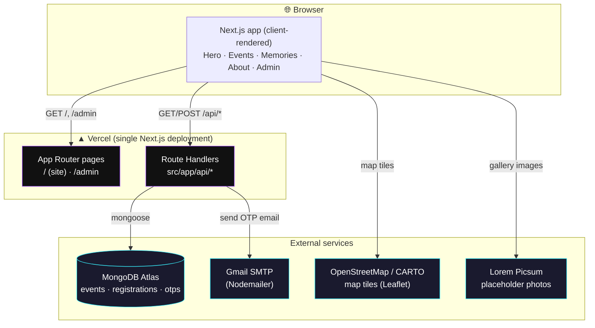
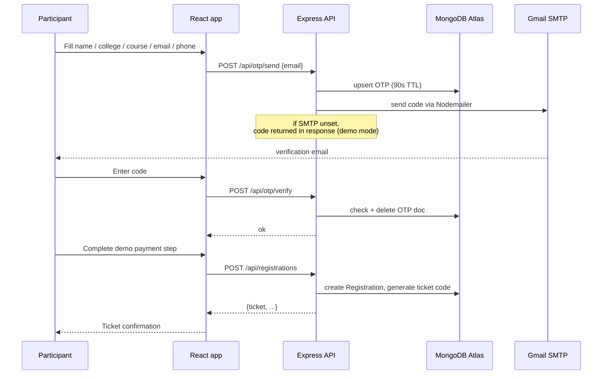

# Gateways — College Fest Site

A Minecraft-biome-themed college fest site: a 3D hero portal, 12 events across
biomes, email-OTP-verified registration with a demo payment step, a memories
wall, and an admin dashboard — built with Next.js (App Router) + Three.js +
GSAP, with MongoDB accessed directly from Next.js Route Handlers, deployed as
a single app on Vercel.

**Live:** https://gateways-fest.vercel.app
**Admin:** https://gateways-fest.vercel.app/admin *(credentials in `.env.local` — see [Access](#access) below)*

---

## Architecture

Frontend and backend ship as **one Next.js app, one Vercel deployment**: the
`/ssr`-and-`/csr`-style page/API split doesn't apply here since the whole
experience is client-rendered (Three.js/GSAP/Lenis), but the API lives in the
same project as Route Handlers under `src/app/api/*` instead of a separate
Express server. Both talk to a MongoDB Atlas cluster.



### Routing

Next.js App Router handles this natively — no `vercel.json` rewrites needed:

| Path | Handled by |
|---|---|
| `/` | `src/app/page.js` (client-rendered site experience) |
| `/admin` | `src/app/admin/page.js` (client-rendered admin dashboard) |
| `/api/*` | Route Handlers under `src/app/api/*` |

### Registration flow



---

## Features

- **Hero** — Three.js floating-island scene, particle/pressure title text, aurora background, scroll parallax
- **Events** — 12 events across 7 biomes, each with its own procedurally-built 3D voxel diorama
- **Registration** — real email OTP verification (Nodemailer/Gmail), demo payment step, unique ticket code per registration
- **Memories** — a 3D "drift wall" gallery of past-season photos with a lightbox
- **About** — animated stat counters, event timeline, embedded venue map (Leaflet/OSM), FAQ accordion
- **Admin dashboard** (`/admin`) — username/password login, lists all registrations from MongoDB
- Smooth inertia scrolling (Lenis) synced with GSAP ScrollTrigger throughout

## Tech stack

| Layer | Tech |
|---|---|
| Frontend | Next.js 16 (App Router), React 19, Tailwind CSS, GSAP, Three.js, Lenis, Leaflet |
| Backend | Next.js Route Handlers, Mongoose |
| Database | MongoDB Atlas |
| Email | Nodemailer (Gmail SMTP) |
| Hosting | Vercel |

## Project structure

```
├── src/
│   ├── app/
│   │   ├── page.js            # "/" — loads the client-rendered site experience
│   │   ├── admin/page.js      # "/admin" — loads the client-rendered admin dashboard
│   │   └── api/                # Route Handlers: events, otp, registrations, admin
│   ├── components/             # SiteExperience, Hero, EventsGrid, AboutSection, ...
│   │   └── reactbits/          # Counter, TrueFocus, TextPressure, ParticleText, DriftWall
│   ├── three/                  # Three.js scene builders (voxel biomes, hero scene)
│   ├── hooks/                  # useEvents, useSmoothScroll, useLiveWeather, useDriftWallLayout
│   ├── lib/                    # api.js (fetch client), otp.js, db.js (Mongoose connection)
│   ├── models/                 # Event, Registration, Otp
│   └── server/mailer.js        # Nodemailer wrapper (route-handler only, never imported by client code)
└── scripts/seed.js             # seeds MongoDB with the event catalog
```

The whole site (`SiteExperience`) and the admin dashboard are loaded via
`next/dynamic(..., { ssr: false })` — the experience is entirely Three.js /
GSAP / Lenis / localStorage driven with no server-renderable content, so
forcing client-only rendering avoids hydration mismatches without losing any
of Next.js's routing, bundling, or Route Handler benefits.

## Local development

Requires Node 18+ and a MongoDB connection (local `mongod` or an Atlas cluster).

```bash
# install
npm install

# copy the env template and fill in real values
cp .env.local.example .env.local

# seed the database with the 12 events
npm run seed

# run the app (frontend + API, one process, one port)
npm run dev
```

### Environment variables

Set in `.env.local` (auto-loaded by Next.js for both `next dev` and `next build`):

| Variable | Purpose |
|---|---|
| `MONGODB_URI` | MongoDB connection string (local or Atlas) |
| `ADMIN_KEY` | Internal key `/api/registrations` requires (issued after admin login) |
| `ADMIN_USER` / `ADMIN_PASS` | Login credentials for `/admin` |
| `SMTP_HOST` / `SMTP_PORT` / `SMTP_USER` / `SMTP_PASS` / `SMTP_FROM` | Gmail SMTP for real OTP email delivery. Leave unset to fall back to demo mode (code shown in the UI instead of emailed). |

Same variables are set in the Vercel project (Production environment) for the live deployment — see `vercel env ls`.

## Deployment

Deployed via the Vercel CLI (`vercel deploy --prod`), linked to the
`gateways-fest` project. Vercel detects the Next.js app automatically — no
`vercel.json` needed. Route Handlers run as serverless functions with a
cached Mongoose connection (reused across warm invocations instead of
reconnecting per request).

To redeploy after changes:

```bash
vercel deploy --prod
```

## Access

| What | Where |
|---|---|
| Live site | https://gateways-fest.vercel.app |
| Admin dashboard | https://gateways-fest.vercel.app/admin — sign in with `ADMIN_USER` / `ADMIN_PASS` (see `.env.local`, not committed) |
| MongoDB Atlas | Cluster `GatewaysFSD8` — connection string in `.env.local` as `MONGODB_URI` |
| Email sender | Gmail account in `SMTP_USER`, authenticated via an app password in `SMTP_PASS` |

Credentials are intentionally **not** included in this file since it's
version-controlled — they live only in the gitignored `.env.local` file
locally and as encrypted environment variables in the Vercel project.
